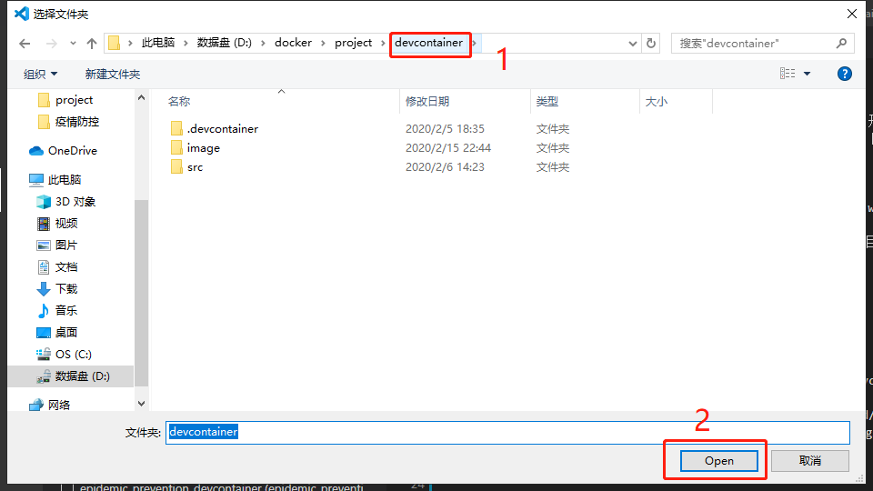

## 简介

本项目是一个基于 Docker 的 JAVA 开发环境，jdk 为 openjdk 11，maven 为 3.6 版本。

## 使用

首先使用本项目前需要安装 Docker、Visual Studio Code 以及 Remote - Containers 插件。  
然后将本项目克隆至本地, 克隆完成后就可以开始启动容器了。   
首先打开 vs Code，然后如下操作。  


然后选择本项目。  


最后等待项目启动。

项目启动完成后打开编辑器的终端使用如下命令新建项目：
```sh
mvn archetype:generate -DgroupId=com.project.app -DartifactId=app-model -Dversion=0.0.1SNAPSHOT -Dpackage=com.project.app
```
>注意：-DgroupId=组织名 公司网址的反写 + 项目名 -DartifactId=项目名-模块名 -Dversion=版本号 -Dpackage=代码所存在的包名

## 更换版本

如果需要更换 JDK 的版本只需要修改 devcontainer.json 和 Dockerfile 这两个文件。
* devcontainer.json 文件修改 java.home 配置项，将地址更换成对应版本的地址即可，如：当前版本是 11，更换为 8 版本的话只需将 11 改为 8 即可。
* Dockerfile 文件修改 FROM 配置项，也是换成对应版本镜像即可，如：当前版本是 11，更换为 8 版本的话也是将 11 改为 8 即可。