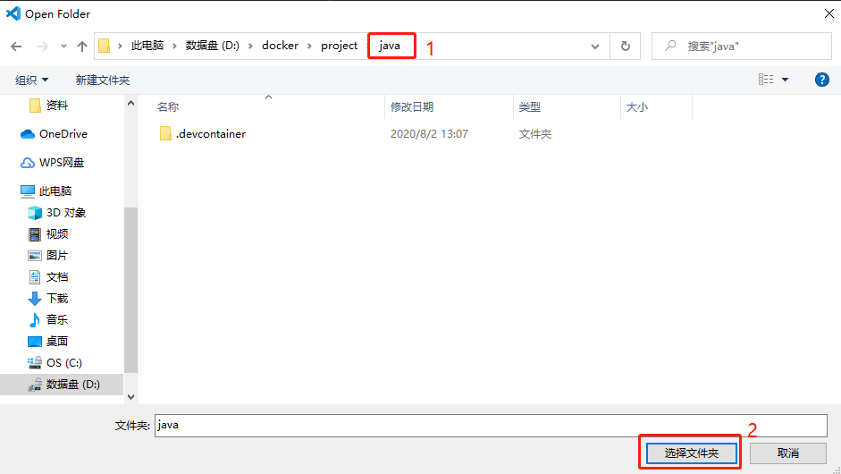
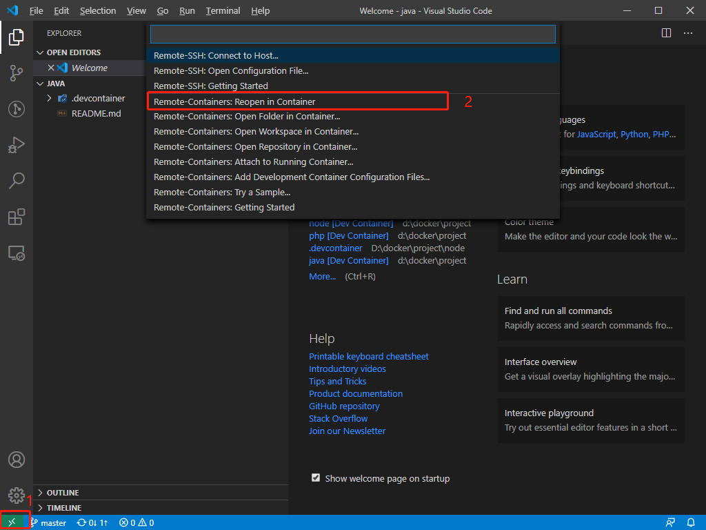

## 简介

本项目是一个基于 Docker 的 JAVA 开发环境，安装应用有 Openjdk、Maven、Tomcat 和 Gradle 默认安装版本如下。

| 应用    | 版本   |
| ------- | ------ |
| Openjdk | 11     |
| Maven   | 3.6    |
| Tomcat  | 9.0.36 |
| Gradle  | 6.5.1  |

## 环境搭建

首先需要安装 Docker 如果是 windows 系统的话则是安装 docker for windows。  
其次 VSCode 需要安装 remote-containers 插件。  

## 开始使用

注意：该项目容器默认会添加到 database_app 网络，如果 database_app 网络不存在则会无法构建，解决方法如：  
1. 删除 `.devcontainer\devcontainer.json` 配置文件中 `runArgs` 配置项的 "--network=database_app" 即可。  
2. 添加 database_app 网络，添加命令 `docker network create database_app`。另可以部署一个数据库 [docker-database 项目](https://github.com/xueyong-q/docker-database.git)。  

首先使用 VSCode 打开本项目，操作如下。   


然后选择在容器中重新打开。  


最后等待项目启动。

项目启动完成后打开编辑器的终端使用如下命令新建项目：
```sh
mvn archetype:generate -DgroupId=com.project.app -DartifactId=app-model -Dversion=0.0.1SNAPSHOT -Dpackage=com.project.app
```
>注意：-DgroupId=组织名 公司网址的反写 + 项目名 -DartifactId=项目名-模块名 -Dversion=版本号 -Dpackage=代码所存在的包名

启动 tomcat:
执行 `tomcatup` 命令启动 tomcat，关闭则执行 `tomcatdown` 命令。

启动后则可以使用主机的 http://localhost 访问 tomcat。  
>如要修改端口映射，可以修改 `.devcontainer\devcontainer.json` 配置文件中 `appPort` 配置项，配置值如：`<主机端口>:<容器内端口>`。  

或者使用 Community Server Connectors 扩展管理 tomcat。  

## 更换版本

如果需要更换 JDK 的版本只需要修改 devcontainer.json 和 Dockerfile 这两个文件。  
* devcontainer.json 文件修改 java.home 配置项，将地址更换成对应版本的地址即可，如：当前版本是 11，更换为 8 版本的话只需将 11 改为 8 即可。  
* Dockerfile 文件修改 FROM 配置项，也是换成对应版本镜像即可，如：当前版本是 11，更换为 8 版本的话也是将 11 改为 8 即可，另还需要设置 ARG 配置项的 JAVA_HOME 环境变量地址，该值应与 java.home 配置一致。  

## VSCode扩展

| 扩展名称                    | 描述 |
| --------------------------- | ---- |
| Java Extension Pack         |      |
| Spring Boot Extension Pack  |      |
| XML                         |      |
| Community Server Connectors |      |
| SonarLint                   |      |
| Checkstyle for Java         |      |
| Markdown All in One         |      |